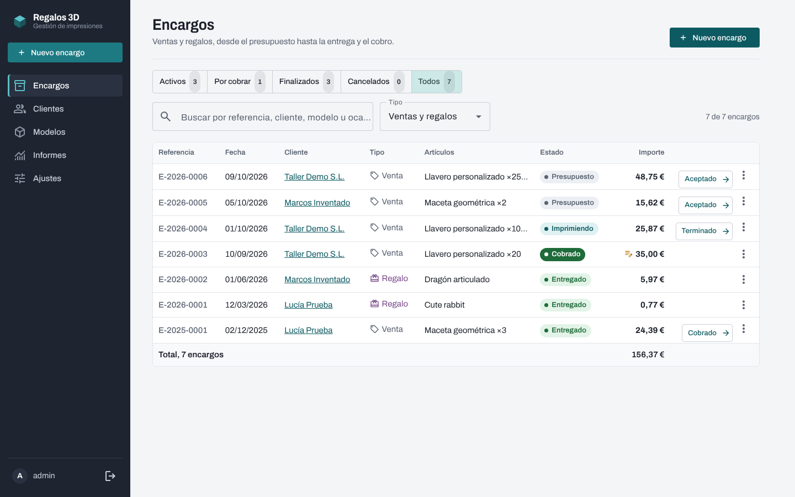
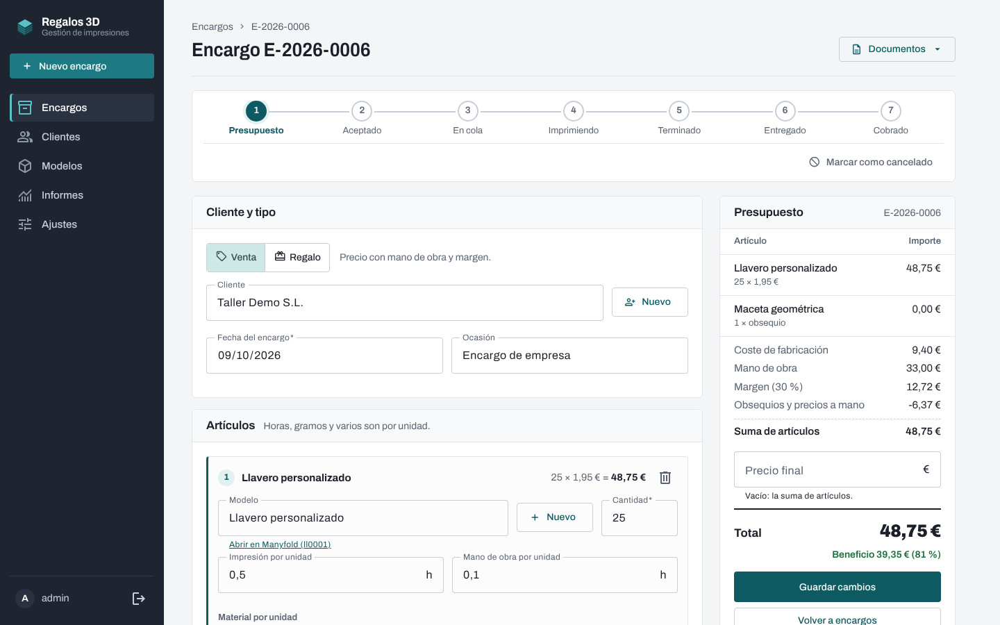
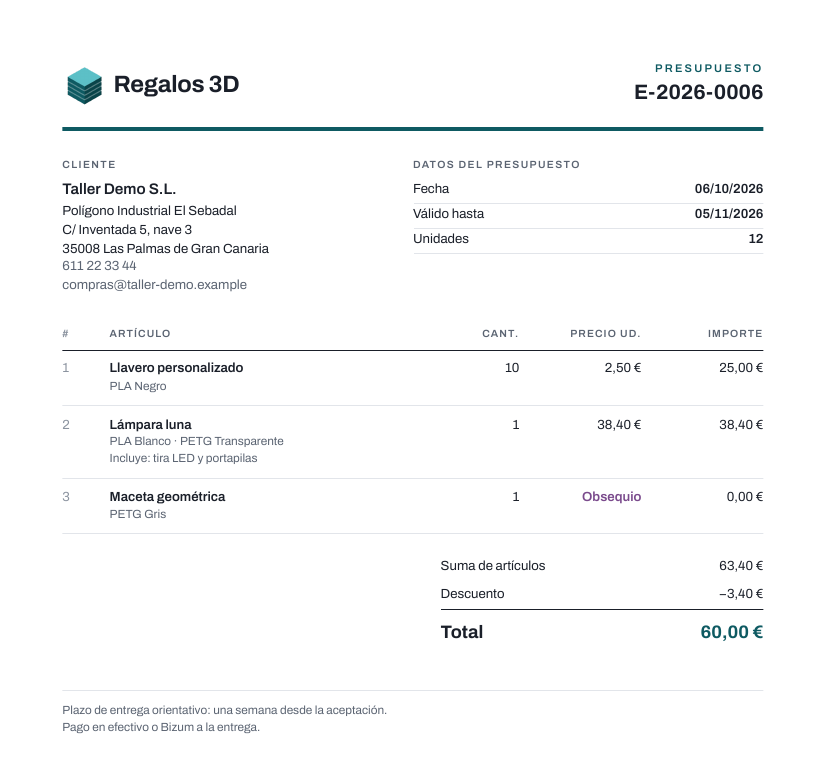
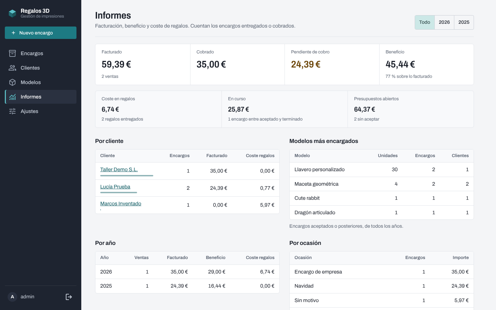
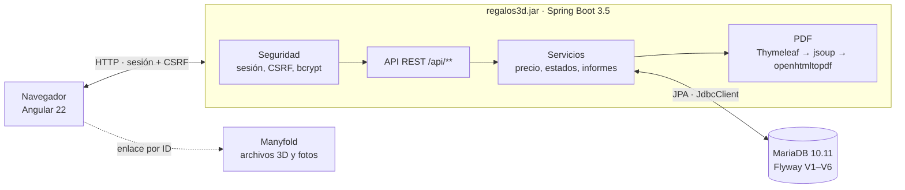

# Regalos 3D


Aplicación web para gestionar un pequeño taller de impresión 3D por encargo: clientes, ventas y regalos, desde el presupuesto hasta la entrega y el cobro, con el **coste real y el precio de venta** de cada pieza y los **documentos en PDF** (presupuesto, albarán y etiqueta).

Los archivos de cada objeto (STL, 3MF, FreeCAD, STEP) y sus fotos viven en [Manyfold](https://manyfold.app); esta app guarda todo lo demás y enlaza cada modelo con su ficha.



## Qué hace

- **Encargos de venta o regalo** con varios artículos. Cada artículo lleva modelo, cantidad, horas de impresión y de mano de obra, bobinas (multicolor) y extras como iluminación o mecanismos.
- **Cálculo del precio** por unidad: material + energía + amortización de la impresora + extras = coste; más mano de obra y margen en las ventas. El presupuesto se recalcula en vivo mientras se edita.
- **Precios a mano y obsequios:** se puede fijar el precio de un artículo o el total del encargo, y añadir piezas de regalo a 0 € cuyo coste sigue contando en el beneficio.
- **Flujo de estados:** Presupuesto → Aceptado → En cola → Imprimiendo → Terminado → Entregado → Cobrado, más Cancelado. Las fechas de entrega y cobro se rellenan solas.
- **Aviso de regalo repetido:** si un cliente ya recibió ese modelo, la app lo advierte antes de guardar.
- **Documentos PDF** generados en el servidor: presupuesto A4, albarán A4 (valorado en ventas, sin precios en regalos) y etiqueta A6 para el paquete.
- **Informes:** facturado, cobrado, pendiente de cobro, beneficio, coste de los regalos y trabajo en curso; por cliente, año, ocasión y modelo.
- **Tarifas configurables** (precio de bobina, luz, mano de obra, amortización, margen); cada encargo guarda las suyas, así que cambiarlas no altera el histórico.

| Encargo con presupuesto en vivo | Presupuesto en PDF |
| --- | --- |
|  |  |



## Arquitectura



Un único `.jar` sirve el frontal Angular compilado, la API y los PDF desde el mismo origen. Manyfold no se consulta desde el código: la app guarda el identificador público de cada modelo y construye el enlace a su ficha.

| Capa | Tecnología |
| --- | --- |
| Backend | Java 21, Spring Boot 3.5, Spring Data JPA (Hibernate 6.6), JdbcClient, Bean Validation, ProblemDetail (RFC 9457) |
| Seguridad | Spring Security: login por formulario con sesión, CSRF con cookie para la SPA, contraseña en bcrypt |
| Datos | MariaDB 10.11, migraciones versionadas con Flyway, Hibernate en modo `validate` |
| PDF | Plantillas Thymeleaf, jsoup, openhtmltopdf (PDFBox 3), fuente Archivo embebida |
| Frontal | Angular 22 (standalone, signals, sin zone.js), Angular Material, formularios reactivos tipados |
| Pruebas | JUnit 5, Mockito, AssertJ, Testcontainers, Vitest |

## Decisiones técnicas

- **Un cálculo, dos implementaciones, los mismos casos.** El precio se calcula en Java (`CalculadoraPrecio`) para guardarlo y en TypeScript (`core/calculo.ts`) para el presupuesto en vivo. Ambos tests usan los mismos casos, así que no pueden divergir sin que falle uno.
- **Importes con `BigDecimal` y redondeo por componente** a céntimos (HALF_UP); en TypeScript, redondeo sin errores de coma flotante.
- **El histórico no cambia solo:** cada encargo copia las tarifas al crearse y guarda los importes calculados.
- **Esquema bajo control:** Flyway crea y migra; Hibernate solo valida. La migración V4 pasó los datos de la versión anterior a encargos sin pérdidas y se probó contra una MariaDB real.
- **CSRF bien resuelto para una SPA:** token en cookie legible por Angular y cabecera `X-XSRF-TOKEN`, con un `CsrfTokenRequestHandler` propio para que la cookie llegue desde la primera petición.
- **PDF en el backend sin navegador:** HTML con Thymeleaf, normalizado con jsoup y pintado con openhtmltopdf; CSS 2.1 y paged media (paginación con cabecera de tabla repetida, numeración de páginas).
- **Errores homogéneos** en formato ProblemDetail, con códigos propios (por ejemplo, `REGALO_DUPLICADO` con los encargos previos).
- **Privacidad por diseño:** uso solo en local, los datos de clientes no salen del equipo y el repositorio solo contiene datos inventados.

## Probarlo en local

Requisitos: Java 21+, Maven, Podman o Docker y Node 24.

```bash
# 1. MariaDB de desarrollo en 127.0.0.1:3307
docker compose -f docker-compose.dev.yml up -d        # o: podman compose …

# 2. Backend con datos de ejemplo inventados (usuario admin / contraseña admin-dev)
mvn spring-boot:run -Dspring-boot.run.profiles=dev

# 3. Frontal, en otra terminal
cd frontend && npm ci && npm start
```

Abre `http://localhost:4200`. El servidor de desarrollo de Angular reenvía `/api` al backend (`proxy.conf.json`), así que sesión, cookies y CSRF funcionan igual que en el `.jar` final.

## Tests

```bash
mvn verify                                      # backend: unitarios + integración
cd frontend && npx ng test --watch=false        # frontal
```

| Suite | Qué cubre |
| --- | --- |
| `CalculadoraPrecioTest`, `EncargoServiceTest` | Cálculo de precios, obsequios, numeración anual, estados, regalo repetido |
| `MotorPdfTest` | Genera los PDF reales y lee su texto con PDFBox: obsequios, regalo sin precios, tamaño A6, escapado, paginación |
| `RegalosIntegrationTest` | MariaDB 10.11 real con Testcontainers: migraciones, validación del esquema, API completa, PDF, login, CSRF |
| Specs de Angular | Cálculo, estados, formulario de encargo, formatos |

Los tests de integración necesitan Docker o el socket de Podman; sin ellos se saltan solos. Con Podman:

```bash
systemctl --user enable --now podman.socket
printf 'docker.host=unix://%s/podman/podman.sock\nryuk.disabled=true\n' "$XDG_RUNTIME_DIR" >> ~/.testcontainers.properties
```

## Uso real

La app se usa en un portátil: un `.jar` contra una MariaDB en contenedor, con scripts para crear la base, compilar, arrancar y hacer copias de seguridad en [`deploy/portatil`](deploy/portatil). Se configura con un `.env` a partir de `env.example`; las credenciales nunca van al repositorio.

```bash
cd deploy/portatil
cp env.example .env       # contraseñas, hash bcrypt del usuario y dirección de Manyfold
./crear-base.sh           # una vez
./construir.sh            # frontal + backend → ~/Apps/regalos3d/regalos3d.jar
./arrancar.sh             # http://localhost:8086
```

También hay un `Dockerfile` de tres etapas (Node → Maven → JRE) y un ejemplo de despliegue con Docker Compose en [`deploy/`](deploy).

## Estructura

```
src/main/java/es/labjc/regalos3d/
  encargo/     encargos, líneas, estados y CalculadoraPrecio
  cliente/     clientes y normalización de móviles
  modelo/      modelos enlazados con Manyfold
  documento/   presupuesto, albarán y etiqueta en PDF
  informe/     informes con JdbcClient
  ajustes/     tarifas del taller y ajustes de documentos
  config/      seguridad, CSRF para la SPA, rutas del frontal
src/main/resources/
  db/migration/   migraciones Flyway V1–V6
  db/dev/         datos de ejemplo (solo perfil dev)
  pdf/            plantillas, estilos, fuentes y logo de los documentos
frontend/src/app/
  core/        API, autenticación, cálculo y estados
  pages/       encargos, clientes, modelos, informes, ajustes, login
deploy/        uso en el portátil y ejemplo de despliegue con Docker
docs/          manual de uso, informe de desarrollo, API e imágenes
```

## Documentación

- [Manual de uso](docs/manual-uso.md)
- [Informe de desarrollo](docs/informe-desarrollo.md)
- [Referencia de la API REST](docs/api.md)

## Autor

Carlos · [github.com/jcarlosx69](https://github.com/jcarlosx69) · proyecto personal dentro de *De la madera al código*.
